# API de Gestión Bancaria

Esta **API permite gestionar cuentas bancarias** y realizar operaciones de **depósito y retiro**. A través de esta API, los usuarios pueden **crear cuentas bancarias**, realizar depósitos y retiros, y consultar las **transacciones** asociadas con una cuenta específica.

## Screenshots
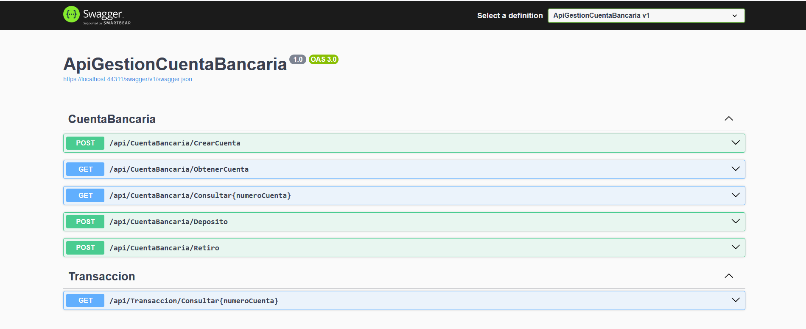

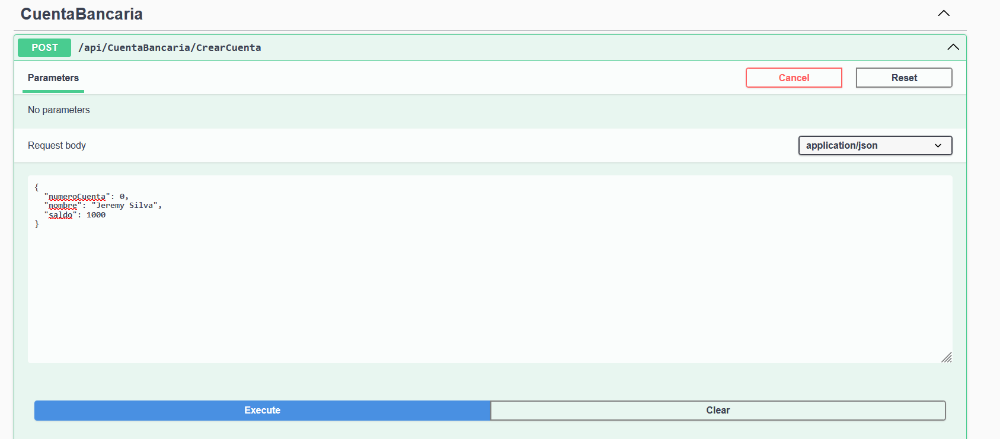

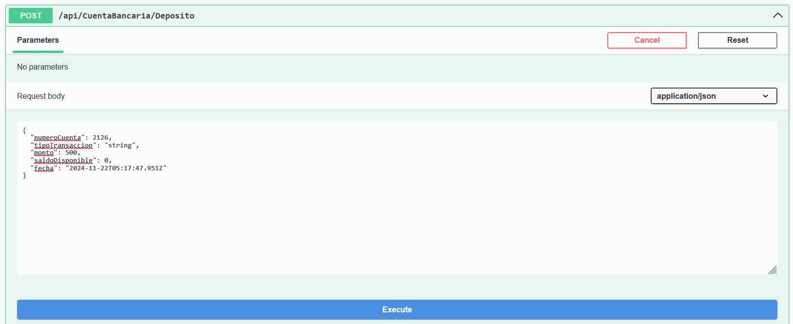

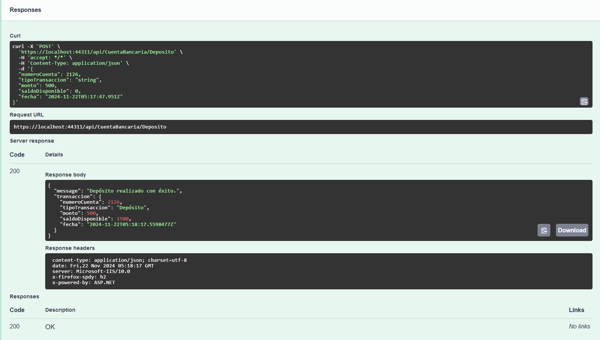

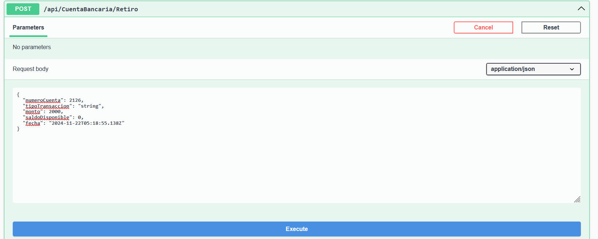

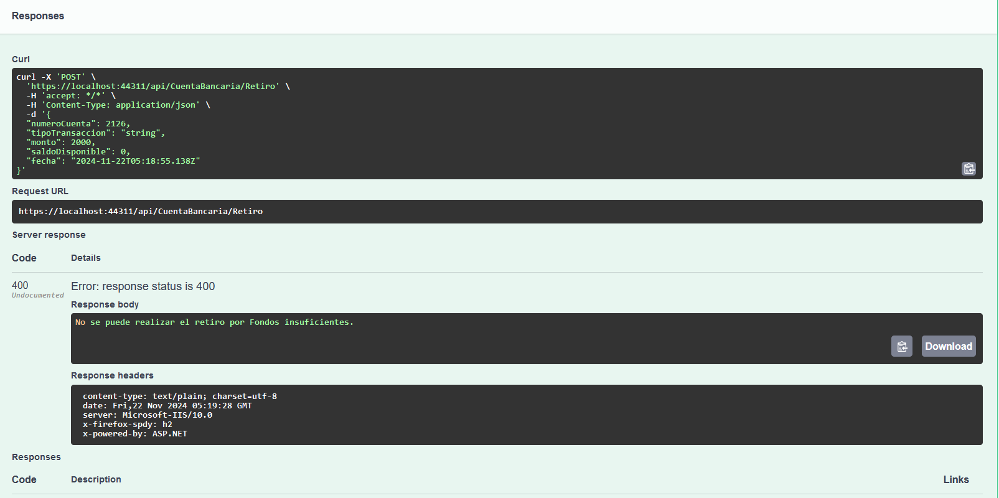

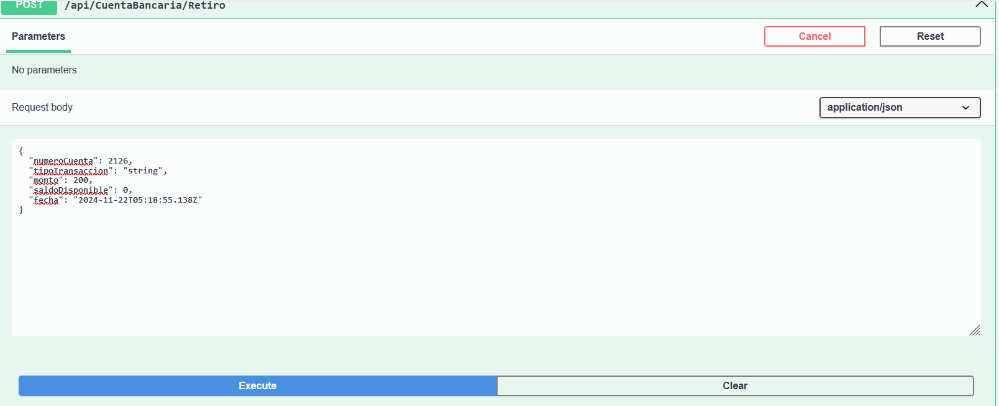

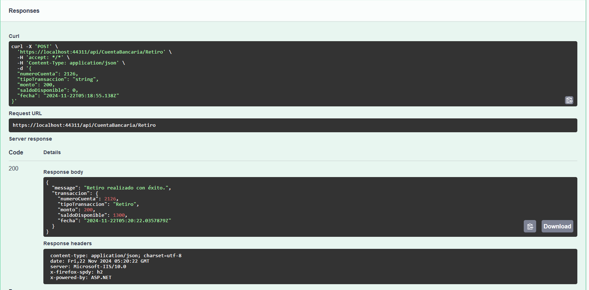

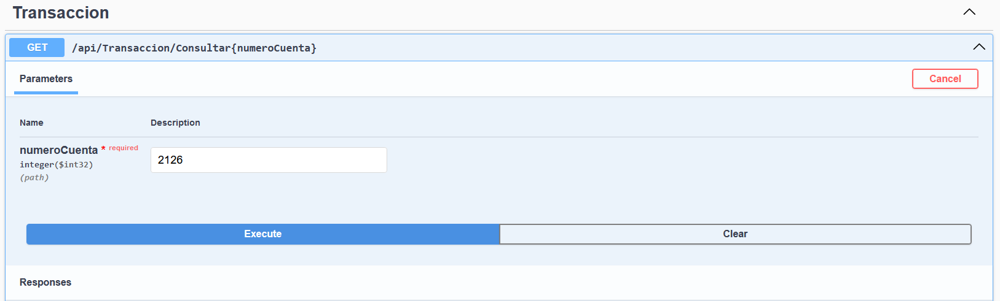

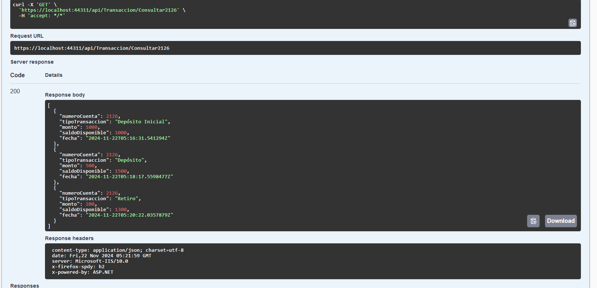

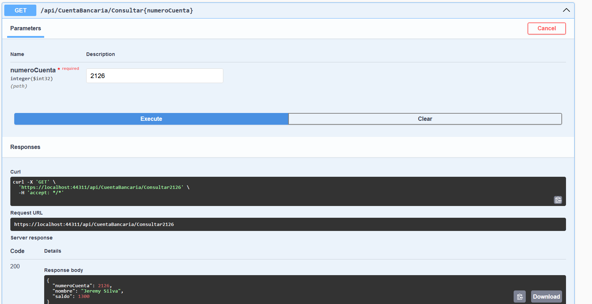

## Funciones

- **Crear una Cuenta Bancaria:** Permite crear una cuenta bancaria con un número de cuenta generado automáticamente, un saldo inicial y el nombre del titular.
- **Realizar un Depósito:** Permite realizar depósitos en una cuenta bancaria existente. El saldo de la cuenta se actualiza y se registra una transacción.
- **Realizar un Retiro:** Permite realizar retiros de una cuenta bancaria, siempre y cuando haya saldo suficiente. Si no hay fondos, se lanza una excepción.
- **Consultar Transacciones por Cuenta:** Permite consultar todas las transacciones asociadas a una cuenta bancaria, como depósitos y retiros.
## Tecnologías

- **.NET 6.0 / .NET 7.0 / .NET 8.0:** Framework de desarrollo utilizado para crear aplicaciones web y servicios en ASP.NET Core.
- **ASP.NET Core:** Framework para la construcción de API RESTful, utilizado para gestionar las solicitudes HTTP.
- **Entity Framework Core:** ORM utilizado para interactuar con la base de datos en memoria (InMemory) y realizar operaciones de lectura y escritura.
- **Base de Datos en Memoria (InMemory):** Usada para pruebas y almacenamiento temporal de datos.
- **Swagger:** Herramienta para la documentación automática de la API, permitiendo explorar y probar los endpoints de manera interactiva.
- **XUnit:** Framework de pruebas unitarias utilizado para validar el correcto funcionamiento de la API.


## Instalación

**Instala el proyecto y las dependencias con** **.NET:**

```bash
  dotnet restore
  dotnet build
  dotnet run
```
**Clona el repositorio en tu máquina local:**
```bash
   git clone https://github.com/Link19661/APIGestionCuentaBancaria.git
   cd tu-repositorio
```
**Restaurar las dependencias del proyecto:**
```bash
   dotnet restore
```
**Compilar el proyecto:**
```bash
   dotnet build
```
**Ejecutar la API:**
```bash
   dotnet run
```
## API Referencia

#### Crear Cuenta Bancaria

```http
  POST /api/CrearCuenta
```

| Parameter | Type     | Description                |
| :-------- | :------- | :------------------------- |
| `NumeroCuenta` | `int` | Generado aleatoriamente y conformada por 4 dígitos|
| `Nombre` | `string` | **Required**. El nombre del titular de la cuenta. |
| `Saldo` | `decimal` | **Required**. El saldo inicial de la cuenta, debe ser mayor o igual a 100.|

#### Realizar Depósito

```http
  POST /api/Deposito
```

| Parameter | Type     | Description                       |
| :-------- | :------- | :-------------------------------- |
| `numeroCuenta`      | `int` | **Required**. El número de la cuenta a la que se hará el depósito. |
| `Monto`      | `decimal` | **Required**. El monto a depositar en la cuenta. |

#### Realizar Retiro

```http
  POST /api/Retiro
```

| Parameter | Type     | Description                       |
| :-------- | :------- | :-------------------------------- |
| `numeroCuenta`      | `int` | **Required**. El número de la cuenta desde la que se realizará el retiro. |
| `Monto`      | `decimal` | **Required**. El monto a retirar de la cuenta.|

#### Consultar Transacciones por Cuenta

```http
  GET /api/Transacciones/{numeroCuenta}
```

| Parameter | Type     | Description                       |
| :-------- | :------- | :-------------------------------- |
| `numeroCuenta`      | `int` | **Required**. El número de la cuenta de la que se desean consultar las transacciones.|


## Uso / Ejemplos

**Crear Cuenta Bancaria:**
**POST /api/CrearCuenta**
```bash
  curl -X POST "http://localhost:5000/api/CrearCuenta" -H 

  "Content-Type: application/json" -d '
  {
    "Nombre": "Jeremy Silva",
    "Saldo": 1000
  }'
```
**Respuesta Esperada:**
```bash
{
    "Id": 1,
    "NumeroCuenta": 1234,
    "Nombre": "Jeremy Silva",
    "Saldo": 1000
}
```
**Realizar un Depósito:**
**POST /api/Deposito**
```bash
  curl -X POST "http://localhost:5000/api/Deposito" -H 
  
  "Content-Type: application/json" -d '
  {
    "numeroCuenta": 1234,
    "Monto": 500
  }'
```
**Respuesta Esperada:**
```bash
{
    "Id": 1,
    "NumeroCuenta": 1234,
    "Nombre": "Jeremy Silva",
    "Saldo": 1000
}
```
**Realizar un Retiro:**
**POST /api/Retiro**
```bash
  curl -X POST "http://localhost:5000/api/Retiro" -H
  
   "Content-Type: application/json" -d '
   {
    "numeroCuenta": 1234,
    "Monto": 300
   }'
```
**Respuesta Esperada:**
```bash
{
    "Id": 1,
    "NumeroCuenta": 1234,
    "Nombre": "Jeremy Silva",
    "Saldo": 1000
}
```
**Consultar Transacciones:**
**GET /api/Transacciones/{numeroCuenta}**
```bash
  curl -X GET "http://localhost:5000/api/Transacciones/1234"
```
**Respuesta Esperada:**
```bash
[
  {
    "NumeroCuenta": 1234,
    "TipoTransaccion": "Depósito",
    "Monto": 1000,
    "SaldoDisponible": 1000,
    "Fecha": "2024-11-21T12:00:00"
  },
  {
    "NumeroCuenta": 1234,
    "TipoTransaccion": "Retiro",
    "Monto": 300,
    "SaldoDisponible": 1200,
    "Fecha": "2024-11-21T13:00:00"
  }
]

```
## Ejecutar Pruebas

Ejecuta el siguiente comando de **.NET**

```bash
  dotnet test
```

